```python
import torch
import matplotlib.pyplot as plt
import numpy as np 
import pandas as pd
```


# 1. LAMBDA LR

Sets the learning rate of each parameter group to the initial lr times a given function. When last_epoch=-1, sets initial lr as lr.

$$
l r_{\text {epoch}} = l r_{\text {initial}} * Lambda(epoch)
$$


```python

model = torch.nn.Linear(2, 1)
optimizer = torch.optim.SGD(model.parameters(), lr=100)
lambda1 = lambda epoch: 0.65 ** epoch
scheduler = torch.optim.lr_scheduler.LambdaLR(optimizer, lr_lambda=lambda1)


lrs = []

for i in range(10):
    optimizer.step()
    lrs.append(optimizer.param_groups[0]["lr"])
    print("Factor = ", round(0.65 ** i,3)," , Learning Rate = ",round(optimizer.param_groups[0]["lr"],3))
    scheduler.step()

plt.plot(range(10),lrs)
```

    Factor =  1.0  , Learning Rate =  100.0
    Factor =  0.65  , Learning Rate =  65.0
    Factor =  0.423  , Learning Rate =  42.25
    Factor =  0.275  , Learning Rate =  27.463
    Factor =  0.179  , Learning Rate =  17.851
    Factor =  0.116  , Learning Rate =  11.603
    Factor =  0.075  , Learning Rate =  7.542
    Factor =  0.049  , Learning Rate =  4.902
    Factor =  0.032  , Learning Rate =  3.186
    Factor =  0.021  , Learning Rate =  2.071
    


    [<matplotlib.lines.Line2D at 0x29bd04c24f0>]


    
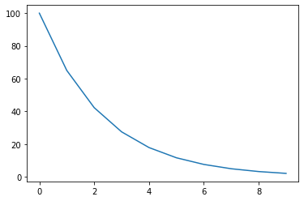
    


# 2. MultiplicativeLR

Multiply the learning rate of each parameter group by the factor given in the specified function. When last_epoch=-1, sets initial lr as lr.

$$
l r_{\text {epoch}} = l r_{\text {epoch - 1}} * Lambda(epoch)
$$


```python
model = torch.nn.Linear(2, 1)
optimizer = torch.optim.SGD(model.parameters(), lr=100)
lmbda = lambda epoch: 0.65 ** epoch
scheduler = torch.optim.lr_scheduler.MultiplicativeLR(optimizer, lr_lambda=lmbda)
lrs = []

for i in range(10):
    optimizer.step()
    lrs.append(optimizer.param_groups[0]["lr"])
    print("Factor = ",0.95," , Learning Rate = ",optimizer.param_groups[0]["lr"])
    scheduler.step()

plt.plot(range(10),lrs)
```

    Factor =  0.95  , Learning Rate =  100
    Factor =  0.95  , Learning Rate =  65.0
    Factor =  0.95  , Learning Rate =  27.462500000000002
    Factor =  0.95  , Learning Rate =  7.541889062500001
    Factor =  0.95  , Learning Rate =  1.3462743344628911
    Factor =  0.95  , Learning Rate =  0.1562069488955407
    Factor =  0.95  , Learning Rate =  0.011780954793617751
    Factor =  0.95  , Learning Rate =  0.0005775292516746525
    Factor =  0.95  , Learning Rate =  1.8402670033873238e-05
    Factor =  0.95  , Learning Rate =  3.811544977260443e-07
    


    [<matplotlib.lines.Line2D at 0x29bd0567a90>]


    
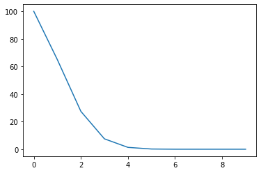
    


# 3. StepLR

Decays the learning rate of each parameter group by gamma every step_size epochs. Notice that such decay can happen simultaneously with other changes to the learning rate from outside this scheduler. When last_epoch=-1, sets initial lr as lr.

$$
l r_{\text {epoch}}=\left\{\begin{array}{ll}
Gamma * l r_{\text {epoch - 1}}, & \text { if } {\text {epoch % step_size}}=0 \\
l r_{\text {epoch - 1}}, & \text { otherwise }
\end{array}\right.
$$


```python
model = torch.nn.Linear(2, 1)
optimizer = torch.optim.SGD(model.parameters(), lr=100)
scheduler = torch.optim.lr_scheduler.StepLR(optimizer, step_size=2, gamma=0.1)
lrs = []

for i in range(10):
    optimizer.step()
    lrs.append(optimizer.param_groups[0]["lr"])
    print("Factor = ",0.1 if i!=0 and i%2!=0 else 1," , Learning Rate = ",optimizer.param_groups[0]["lr"])
    scheduler.step()

plt.plot(range(10),lrs)
```

    Factor =  1  , Learning Rate =  100
    Factor =  0.1  , Learning Rate =  100
    Factor =  1  , Learning Rate =  10.0
    Factor =  0.1  , Learning Rate =  10.0
    Factor =  1  , Learning Rate =  1.0
    Factor =  0.1  , Learning Rate =  1.0
    Factor =  1  , Learning Rate =  0.1
    Factor =  0.1  , Learning Rate =  0.1
    Factor =  1  , Learning Rate =  0.010000000000000002
    Factor =  0.1  , Learning Rate =  0.010000000000000002
    


    [<matplotlib.lines.Line2D at 0x29bd05c8a30>]


    
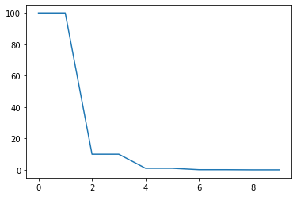
    


# 4. MultiStepLR

Decays the learning rate of each parameter group by gamma once the number of epoch reaches one of the milestones. Notice that such decay can happen simultaneously with other changes to the learning rate from outside this scheduler. When last_epoch=-1, sets initial lr as lr.

$$
l r_{\text {epoch}}=\left\{\begin{array}{ll}
Gamma * l r_{\text {epoch - 1}}, & \text { if } {\text{ epoch in [milestones]}} \\
l r_{\text {epoch - 1}}, & \text { otherwise }
\end{array}\right.
$$


```python

model = torch.nn.Linear(2, 1)
optimizer = torch.optim.SGD(model.parameters(), lr=100)
scheduler = torch.optim.lr_scheduler.MultiStepLR(optimizer, milestones=[6,8,9], gamma=0.1)
lrs = []

for i in range(10):
    optimizer.step()
    lrs.append(optimizer.param_groups[0]["lr"])
    print("Factor = ",0.1 if i in [6,8,9] else 1," , Learning Rate = ",optimizer.param_groups[0]["lr"])
    scheduler.step()

plt.plot(range(10),lrs)
```

    Factor =  1  , Learning Rate =  100
    Factor =  1  , Learning Rate =  100
    Factor =  1  , Learning Rate =  100
    Factor =  1  , Learning Rate =  100
    Factor =  1  , Learning Rate =  100
    Factor =  1  , Learning Rate =  100
    Factor =  0.1  , Learning Rate =  10.0
    Factor =  1  , Learning Rate =  10.0
    Factor =  0.1  , Learning Rate =  1.0
    Factor =  0.1  , Learning Rate =  0.1
    


    [<matplotlib.lines.Line2D at 0x29bd1604370>]


    
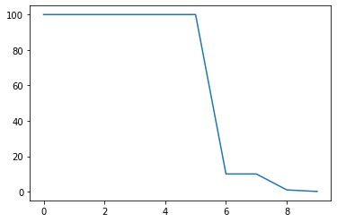
    


# 5. ExponentialLR

Decays the learning rate of each parameter group by gamma every epoch. When last_epoch=-1, sets initial lr as lr.

$$
l r_{\text {epoch}}= Gamma * l r_{\text {epoch - 1}}
$$


```python

model = torch.nn.Linear(2, 1)
optimizer = torch.optim.SGD(model.parameters(), lr=100)
scheduler = torch.optim.lr_scheduler.ExponentialLR(optimizer, gamma=0.1)
lrs = []


for i in range(10):
    optimizer.step()
    lrs.append(optimizer.param_groups[0]["lr"])
    print("Factor = ",0.1," , Learning Rate = ",optimizer.param_groups[0]["lr"])
    scheduler.step()

plt.plot(lrs)

```

    Factor =  0.1  , Learning Rate =  100
    Factor =  0.1  , Learning Rate =  10.0
    Factor =  0.1  , Learning Rate =  1.0
    Factor =  0.1  , Learning Rate =  0.1
    Factor =  0.1  , Learning Rate =  0.010000000000000002
    Factor =  0.1  , Learning Rate =  0.0010000000000000002
    Factor =  0.1  , Learning Rate =  0.00010000000000000003
    Factor =  0.1  , Learning Rate =  1.0000000000000004e-05
    Factor =  0.1  , Learning Rate =  1.0000000000000004e-06
    Factor =  0.1  , Learning Rate =  1.0000000000000005e-07
    


    [<matplotlib.lines.Line2D at 0x29bd1662ca0>]


    
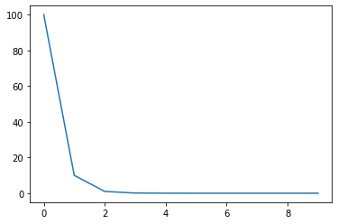
    


# 6. CosineAnnealingLR

Set the learning rate of each parameter group using a cosine annealing schedule.
When last_epoch=-1, sets initial lr as lr. Notice that because the schedule is defined recursively, the learning rate can be simultaneously modified outside this scheduler by other operators. If the learning rate is set solely by this scheduler, the learning rate at each step becomes:

$$
\eta_{t}=\eta_{\min }+\frac{1}{2}\left(\eta_{\max }-\eta_{\min }\right)\left(1+\cos \left(\frac{T_{c u r}}{T_{\max }} \pi\right)\right)
$$

It has been proposed in SGDR: Stochastic Gradient Descent with Warm Restarts. Note that this only implements the cosine annealing part of SGDR, and not the restarts.https://arxiv.org/abs/1608.03983


```python

model = torch.nn.Linear(2, 1)
optimizer = torch.optim.SGD(model.parameters(), lr=100)
scheduler = torch.optim.lr_scheduler.CosineAnnealingLR(optimizer, T_max=10, eta_min=0)
lrs = []


for i in range(100):
    optimizer.step()
    lrs.append(optimizer.param_groups[0]["lr"])
    print("Factor = ",i," , Learning Rate = ",optimizer.param_groups[0]["lr"])
    scheduler.step()

plt.plot(lrs)

```

    Factor =  0  , Learning Rate =  100
    Factor =  1  , Learning Rate =  97.55282581475768
    Factor =  2  , Learning Rate =  90.45084971874736
    Factor =  3  , Learning Rate =  79.38926261462365
    Factor =  4  , Learning Rate =  65.45084971874736
    Factor =  5  , Learning Rate =  49.99999999999999
    Factor =  6  , Learning Rate =  34.54915028125263
    Factor =  7  , Learning Rate =  20.610737385376346
    Factor =  8  , Learning Rate =  9.549150281252633
    Factor =  9  , Learning Rate =  2.447174185242323
    Factor =  10  , Learning Rate =  0.0
    Factor =  11  , Learning Rate =  2.447174185242323
    Factor =  12  , Learning Rate =  9.54915028125267
    Factor =  13  , Learning Rate =  20.610737385376428
    Factor =  14  , Learning Rate =  34.54915028125278
    Factor =  15  , Learning Rate =  50.00000000000021
    Factor =  16  , Learning Rate =  65.45084971874765
    Factor =  17  , Learning Rate =  79.38926261462399
    Factor =  18  , Learning Rate =  90.45084971874776
    Factor =  19  , Learning Rate =  97.5528258147581
    Factor =  20  , Learning Rate =  100.00000000000041
    Factor =  21  , Learning Rate =  97.55282581475808
    Factor =  22  , Learning Rate =  90.45084971874778
    Factor =  23  , Learning Rate =  79.38926261462399
    Factor =  24  , Learning Rate =  65.45084971874765
    Factor =  25  , Learning Rate =  50.00000000000021
    Factor =  26  , Learning Rate =  34.549150281252786
    Factor =  27  , Learning Rate =  20.610737385376442
    Factor =  28  , Learning Rate =  9.549150281252679
    Factor =  29  , Learning Rate =  2.447174185242339
    Factor =  30  , Learning Rate =  0.0
    Factor =  31  , Learning Rate =  2.447174185242323
    Factor =  32  , Learning Rate =  9.549150281252638
    Factor =  33  , Learning Rate =  20.61073738537637
    Factor =  34  , Learning Rate =  34.54915028125268
    Factor =  35  , Learning Rate =  50.000000000000085
    Factor =  36  , Learning Rate =  65.45084971874749
    Factor =  37  , Learning Rate =  79.38926261462382
    Factor =  38  , Learning Rate =  90.45084971874755
    Factor =  39  , Learning Rate =  97.55282581475788
    Factor =  40  , Learning Rate =  100.00000000000023
    Factor =  41  , Learning Rate =  97.55282581475794
    Factor =  42  , Learning Rate =  90.4508497187476
    Factor =  43  , Learning Rate =  79.38926261462386
    Factor =  44  , Learning Rate =  65.45084971874763
    Factor =  45  , Learning Rate =  50.000000000000135
    Factor =  46  , Learning Rate =  34.54915028125273
    Factor =  47  , Learning Rate =  20.61073738537634
    Factor =  48  , Learning Rate =  9.549150281252667
    Factor =  49  , Learning Rate =  2.4471741852423627
    Factor =  50  , Learning Rate =  0.0
    Factor =  51  , Learning Rate =  2.447174185242323
    Factor =  52  , Learning Rate =  9.54915028125276
    Factor =  53  , Learning Rate =  20.610737385376712
    Factor =  54  , Learning Rate =  34.549150281253134
    Factor =  55  , Learning Rate =  50.00000000000084
    Factor =  56  , Learning Rate =  65.45084971874836
    Factor =  57  , Learning Rate =  79.3892626146248
    Factor =  58  , Learning Rate =  90.45084971874876
    Factor =  59  , Learning Rate =  97.55282581475915
    Factor =  60  , Learning Rate =  100.00000000000153
    Factor =  61  , Learning Rate =  97.55282581475916
    Factor =  62  , Learning Rate =  90.45084971874878
    Factor =  63  , Learning Rate =  79.38926261462484
    Factor =  64  , Learning Rate =  65.4508497187484
    Factor =  65  , Learning Rate =  50.000000000000895
    Factor =  66  , Learning Rate =  34.54915028125319
    Factor =  67  , Learning Rate =  20.610737385376762
    Factor =  68  , Learning Rate =  9.549150281252802
    Factor =  69  , Learning Rate =  2.447174185242344
    Factor =  70  , Learning Rate =  0.0
    Factor =  71  , Learning Rate =  2.447174185242323
    Factor =  72  , Learning Rate =  9.549150281252562
    Factor =  73  , Learning Rate =  20.610737385376144
    Factor =  74  , Learning Rate =  34.54915028125242
    Factor =  75  , Learning Rate =  49.99999999999964
    Factor =  76  , Learning Rate =  65.45084971874704
    Factor =  77  , Learning Rate =  79.38926261462333
    Factor =  78  , Learning Rate =  90.45084971874695
    Factor =  79  , Learning Rate =  97.55282581475726
    Factor =  80  , Learning Rate =  99.99999999999956
    Factor =  81  , Learning Rate =  97.5528258147573
    Factor =  82  , Learning Rate =  90.45084971874711
    Factor =  83  , Learning Rate =  79.38926261462328
    Factor =  84  , Learning Rate =  65.45084971874712
    Factor =  85  , Learning Rate =  49.99999999999974
    Factor =  86  , Learning Rate =  34.54915028125253
    Factor =  87  , Learning Rate =  20.610737385376368
    Factor =  88  , Learning Rate =  9.549150281252723
    Factor =  89  , Learning Rate =  2.4471741852423015
    Factor =  90  , Learning Rate =  0.0
    Factor =  91  , Learning Rate =  2.447174185242323
    Factor =  92  , Learning Rate =  9.549150281252766
    Factor =  93  , Learning Rate =  20.6107373853766
    Factor =  94  , Learning Rate =  34.54915028125337
    Factor =  95  , Learning Rate =  50.00000000000094
    Factor =  96  , Learning Rate =  65.4508497187485
    Factor =  97  , Learning Rate =  79.38926261462497
    Factor =  98  , Learning Rate =  90.45084971874887
    Factor =  99  , Learning Rate =  97.55282581475944
    


    [<matplotlib.lines.Line2D at 0x29bd16c2c70>]


    
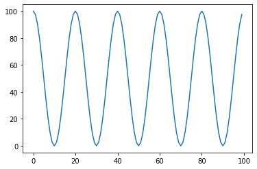
    


# 7. CyclicLR - triangular


```python

model = torch.nn.Linear(2, 1)
optimizer = torch.optim.SGD(model.parameters(), lr=0.1)
scheduler = torch.optim.lr_scheduler.CyclicLR(optimizer, base_lr=0.001, max_lr=0.1,step_size_up=5,mode="triangular")
lrs = []


for i in range(100):
    optimizer.step()
    lrs.append(optimizer.param_groups[0]["lr"])
    print("Factor = ",i," , Learning Rate = ",optimizer.param_groups[0]["lr"])
    scheduler.step()

plt.plot(lrs)

```

    Factor =  0  , Learning Rate =  0.001
    Factor =  1  , Learning Rate =  0.02080000000000002
    Factor =  2  , Learning Rate =  0.0406
    Factor =  3  , Learning Rate =  0.06040000000000001
    Factor =  4  , Learning Rate =  0.0802
    Factor =  5  , Learning Rate =  0.1
    Factor =  6  , Learning Rate =  0.0802
    Factor =  7  , Learning Rate =  0.06040000000000001
    Factor =  8  , Learning Rate =  0.0406
    Factor =  9  , Learning Rate =  0.02080000000000002
    Factor =  10  , Learning Rate =  0.001
    Factor =  11  , Learning Rate =  0.02080000000000002
    Factor =  12  , Learning Rate =  0.04060000000000004
    Factor =  13  , Learning Rate =  0.06039999999999997
    Factor =  14  , Learning Rate =  0.0802
    Factor =  15  , Learning Rate =  0.1
    Factor =  16  , Learning Rate =  0.0802
    Factor =  17  , Learning Rate =  0.06039999999999997
    Factor =  18  , Learning Rate =  0.04060000000000004
    Factor =  19  , Learning Rate =  0.02080000000000002
    Factor =  20  , Learning Rate =  0.001
    Factor =  21  , Learning Rate =  0.02080000000000002
    Factor =  22  , Learning Rate =  0.04060000000000004
    Factor =  23  , Learning Rate =  0.06039999999999997
    Factor =  24  , Learning Rate =  0.0802
    Factor =  25  , Learning Rate =  0.1
    Factor =  26  , Learning Rate =  0.0802
    Factor =  27  , Learning Rate =  0.06039999999999997
    Factor =  28  , Learning Rate =  0.04060000000000004
    Factor =  29  , Learning Rate =  0.02080000000000002
    Factor =  30  , Learning Rate =  0.001
    Factor =  31  , Learning Rate =  0.020799999999999933
    Factor =  32  , Learning Rate =  0.04060000000000004
    Factor =  33  , Learning Rate =  0.06039999999999997
    Factor =  34  , Learning Rate =  0.08020000000000008
    Factor =  35  , Learning Rate =  0.1
    Factor =  36  , Learning Rate =  0.08020000000000008
    Factor =  37  , Learning Rate =  0.06039999999999997
    Factor =  38  , Learning Rate =  0.04060000000000004
    Factor =  39  , Learning Rate =  0.020799999999999933
    Factor =  40  , Learning Rate =  0.001
    Factor =  41  , Learning Rate =  0.020799999999999933
    Factor =  42  , Learning Rate =  0.04060000000000004
    Factor =  43  , Learning Rate =  0.06039999999999997
    Factor =  44  , Learning Rate =  0.08020000000000008
    Factor =  45  , Learning Rate =  0.1
    Factor =  46  , Learning Rate =  0.08020000000000008
    Factor =  47  , Learning Rate =  0.06039999999999997
    Factor =  48  , Learning Rate =  0.04060000000000004
    Factor =  49  , Learning Rate =  0.020799999999999933
    Factor =  50  , Learning Rate =  0.001
    Factor =  51  , Learning Rate =  0.020799999999999933
    Factor =  52  , Learning Rate =  0.04060000000000004
    Factor =  53  , Learning Rate =  0.06039999999999997
    Factor =  54  , Learning Rate =  0.08020000000000008
    Factor =  55  , Learning Rate =  0.1
    Factor =  56  , Learning Rate =  0.08020000000000008
    Factor =  57  , Learning Rate =  0.06039999999999997
    Factor =  58  , Learning Rate =  0.04060000000000004
    Factor =  59  , Learning Rate =  0.020799999999999933
    Factor =  60  , Learning Rate =  0.001
    Factor =  61  , Learning Rate =  0.020799999999999933
    Factor =  62  , Learning Rate =  0.04060000000000004
    Factor =  63  , Learning Rate =  0.06039999999999997
    Factor =  64  , Learning Rate =  0.08020000000000008
    Factor =  65  , Learning Rate =  0.1
    Factor =  66  , Learning Rate =  0.08020000000000008
    Factor =  67  , Learning Rate =  0.06039999999999997
    Factor =  68  , Learning Rate =  0.04060000000000004
    Factor =  69  , Learning Rate =  0.020799999999999933
    Factor =  70  , Learning Rate =  0.001
    Factor =  71  , Learning Rate =  0.020799999999999933
    Factor =  72  , Learning Rate =  0.040599999999999865
    Factor =  73  , Learning Rate =  0.06040000000000014
    Factor =  74  , Learning Rate =  0.08020000000000008
    Factor =  75  , Learning Rate =  0.1
    Factor =  76  , Learning Rate =  0.08020000000000008
    Factor =  77  , Learning Rate =  0.06040000000000014
    Factor =  78  , Learning Rate =  0.040599999999999865
    Factor =  79  , Learning Rate =  0.020799999999999933
    Factor =  80  , Learning Rate =  0.001
    Factor =  81  , Learning Rate =  0.020799999999999933
    Factor =  82  , Learning Rate =  0.040599999999999865
    Factor =  83  , Learning Rate =  0.06040000000000014
    Factor =  84  , Learning Rate =  0.08020000000000008
    Factor =  85  , Learning Rate =  0.1
    Factor =  86  , Learning Rate =  0.08020000000000008
    Factor =  87  , Learning Rate =  0.06040000000000014
    Factor =  88  , Learning Rate =  0.040599999999999865
    Factor =  89  , Learning Rate =  0.020799999999999933
    Factor =  90  , Learning Rate =  0.001
    Factor =  91  , Learning Rate =  0.020799999999999933
    Factor =  92  , Learning Rate =  0.040599999999999865
    Factor =  93  , Learning Rate =  0.06040000000000014
    Factor =  94  , Learning Rate =  0.08020000000000008
    Factor =  95  , Learning Rate =  0.1
    Factor =  96  , Learning Rate =  0.08020000000000008
    Factor =  97  , Learning Rate =  0.06040000000000014
    Factor =  98  , Learning Rate =  0.040599999999999865
    Factor =  99  , Learning Rate =  0.020799999999999933
    


    [<matplotlib.lines.Line2D at 0x29bd172a8b0>]


    
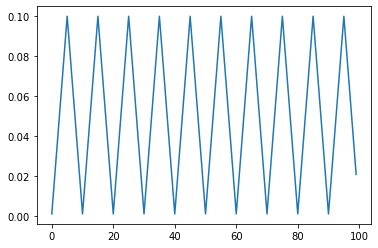
    


# 7. CyclicLR - triangular2


```python

model = torch.nn.Linear(2, 1)
optimizer = torch.optim.SGD(model.parameters(), lr=0.1)
scheduler = torch.optim.lr_scheduler.CyclicLR(optimizer, base_lr=0.001, max_lr=0.1,step_size_up=5,mode="triangular2")
lrs = []


for i in range(100):
    optimizer.step()
    lrs.append(optimizer.param_groups[0]["lr"])
    print("Factor = ",i," , Learning Rate = ",optimizer.param_groups[0]["lr"])
    scheduler.step()

plt.plot(lrs)

```

    Factor =  0  , Learning Rate =  0.001
    Factor =  1  , Learning Rate =  0.02080000000000002
    Factor =  2  , Learning Rate =  0.0406
    Factor =  3  , Learning Rate =  0.06040000000000001
    Factor =  4  , Learning Rate =  0.0802
    Factor =  5  , Learning Rate =  0.1
    Factor =  6  , Learning Rate =  0.0802
    Factor =  7  , Learning Rate =  0.06040000000000001
    Factor =  8  , Learning Rate =  0.0406
    Factor =  9  , Learning Rate =  0.02080000000000002
    Factor =  10  , Learning Rate =  0.001
    Factor =  11  , Learning Rate =  0.01090000000000001
    Factor =  12  , Learning Rate =  0.02080000000000002
    Factor =  13  , Learning Rate =  0.030699999999999984
    Factor =  14  , Learning Rate =  0.0406
    Factor =  15  , Learning Rate =  0.0505
    Factor =  16  , Learning Rate =  0.0406
    Factor =  17  , Learning Rate =  0.030699999999999984
    Factor =  18  , Learning Rate =  0.02080000000000002
    Factor =  19  , Learning Rate =  0.01090000000000001
    Factor =  20  , Learning Rate =  0.001
    Factor =  21  , Learning Rate =  0.005950000000000005
    Factor =  22  , Learning Rate =  0.01090000000000001
    Factor =  23  , Learning Rate =  0.015849999999999993
    Factor =  24  , Learning Rate =  0.0208
    Factor =  25  , Learning Rate =  0.025750000000000002
    Factor =  26  , Learning Rate =  0.0208
    Factor =  27  , Learning Rate =  0.015849999999999993
    Factor =  28  , Learning Rate =  0.01090000000000001
    Factor =  29  , Learning Rate =  0.005950000000000005
    Factor =  30  , Learning Rate =  0.001
    Factor =  31  , Learning Rate =  0.0034749999999999916
    Factor =  32  , Learning Rate =  0.005950000000000005
    Factor =  33  , Learning Rate =  0.008424999999999995
    Factor =  34  , Learning Rate =  0.01090000000000001
    Factor =  35  , Learning Rate =  0.013375000000000001
    Factor =  36  , Learning Rate =  0.01090000000000001
    Factor =  37  , Learning Rate =  0.008424999999999995
    Factor =  38  , Learning Rate =  0.005950000000000005
    Factor =  39  , Learning Rate =  0.0034749999999999916
    Factor =  40  , Learning Rate =  0.001
    Factor =  41  , Learning Rate =  0.0022374999999999956
    Factor =  42  , Learning Rate =  0.0034750000000000024
    Factor =  43  , Learning Rate =  0.004712499999999998
    Factor =  44  , Learning Rate =  0.005950000000000005
    Factor =  45  , Learning Rate =  0.0071875
    Factor =  46  , Learning Rate =  0.005950000000000005
    Factor =  47  , Learning Rate =  0.004712499999999998
    Factor =  48  , Learning Rate =  0.0034750000000000024
    Factor =  49  , Learning Rate =  0.0022374999999999956
    Factor =  50  , Learning Rate =  0.001
    Factor =  51  , Learning Rate =  0.0016187499999999978
    Factor =  52  , Learning Rate =  0.002237500000000001
    Factor =  53  , Learning Rate =  0.002856249999999999
    Factor =  54  , Learning Rate =  0.0034750000000000024
    Factor =  55  , Learning Rate =  0.00409375
    Factor =  56  , Learning Rate =  0.0034750000000000024
    Factor =  57  , Learning Rate =  0.002856249999999999
    Factor =  58  , Learning Rate =  0.002237500000000001
    Factor =  59  , Learning Rate =  0.0016187499999999978
    Factor =  60  , Learning Rate =  0.001
    Factor =  61  , Learning Rate =  0.001309374999999999
    Factor =  62  , Learning Rate =  0.0016187500000000006
    Factor =  63  , Learning Rate =  0.0019281249999999995
    Factor =  64  , Learning Rate =  0.002237500000000001
    Factor =  65  , Learning Rate =  0.002546875
    Factor =  66  , Learning Rate =  0.002237500000000001
    Factor =  67  , Learning Rate =  0.0019281249999999995
    Factor =  68  , Learning Rate =  0.0016187500000000006
    Factor =  69  , Learning Rate =  0.001309374999999999
    Factor =  70  , Learning Rate =  0.001
    Factor =  71  , Learning Rate =  0.0011546874999999995
    Factor =  72  , Learning Rate =  0.001309374999999999
    Factor =  73  , Learning Rate =  0.0014640625000000012
    Factor =  74  , Learning Rate =  0.0016187500000000006
    Factor =  75  , Learning Rate =  0.0017734375
    Factor =  76  , Learning Rate =  0.0016187500000000006
    Factor =  77  , Learning Rate =  0.0014640625000000012
    Factor =  78  , Learning Rate =  0.001309374999999999
    Factor =  79  , Learning Rate =  0.0011546874999999995
    Factor =  80  , Learning Rate =  0.001
    Factor =  81  , Learning Rate =  0.0010773437499999997
    Factor =  82  , Learning Rate =  0.0011546874999999995
    Factor =  83  , Learning Rate =  0.0012320312500000005
    Factor =  84  , Learning Rate =  0.0013093750000000002
    Factor =  85  , Learning Rate =  0.00138671875
    Factor =  86  , Learning Rate =  0.0013093750000000002
    Factor =  87  , Learning Rate =  0.0012320312500000005
    Factor =  88  , Learning Rate =  0.0011546874999999995
    Factor =  89  , Learning Rate =  0.0010773437499999997
    Factor =  90  , Learning Rate =  0.001
    Factor =  91  , Learning Rate =  0.0010386718749999999
    Factor =  92  , Learning Rate =  0.0010773437499999997
    Factor =  93  , Learning Rate =  0.0011160156250000003
    Factor =  94  , Learning Rate =  0.0011546875000000001
    Factor =  95  , Learning Rate =  0.001193359375
    Factor =  96  , Learning Rate =  0.0011546875000000001
    Factor =  97  , Learning Rate =  0.0011160156250000003
    Factor =  98  , Learning Rate =  0.0010773437499999997
    Factor =  99  , Learning Rate =  0.0010386718749999999
    


    [<matplotlib.lines.Line2D at 0x29bd17985e0>]


    
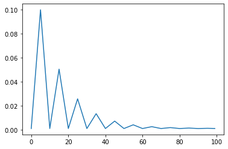
    


# 7. CyclicLR - exp_range


```python

model = torch.nn.Linear(2, 1)
optimizer = torch.optim.SGD(model.parameters(), lr=100)
scheduler = torch.optim.lr_scheduler.CyclicLR(optimizer, base_lr=0.001, max_lr=0.1,step_size_up=5,mode="exp_range",gamma=0.85)
lrs = []


for i in range(100):
    optimizer.step()
    lrs.append(optimizer.param_groups[0]["lr"])
    print("Factor = ",i," , Learning Rate = ",optimizer.param_groups[0]["lr"])
    scheduler.step()

plt.plot(lrs)

```

    Factor =  0  , Learning Rate =  0.001
    Factor =  1  , Learning Rate =  0.017830000000000016
    Factor =  2  , Learning Rate =  0.029610999999999995
    Factor =  3  , Learning Rate =  0.037479025
    Factor =  4  , Learning Rate =  0.04234289499999999
    Factor =  5  , Learning Rate =  0.0449268259375
    Factor =  6  , Learning Rate =  0.030870241637499993
    Factor =  7  , Learning Rate =  0.02004227904390625
    Factor =  8  , Learning Rate =  0.011790624791546873
    Factor =  9  , Learning Rate =  0.005586015536407425
    Factor =  10  , Learning Rate =  0.001
    Factor =  11  , Learning Rate =  0.004313396225054365
    Factor =  12  , Learning Rate =  0.006632773582592419
    Factor =  13  , Learning Rate =  0.008181786317805324
    Factor =  14  , Learning Rate =  0.009139357826846037
    Factor =  15  , Learning Rate =  0.009648067691023915
    Factor =  16  , Learning Rate =  0.006880686029896261
    Factor =  17  , Learning Rate =  0.004748937344058865
    Factor =  18  , Learning Rate =  0.0031243978283000268
    Factor =  19  , Learning Rate =  0.0019028690770275113
    Factor =  20  , Learning Rate =  0.001
    Factor =  21  , Learning Rate =  0.001652322908152377
    Factor =  22  , Learning Rate =  0.0021089489438590407
    Factor =  23  , Learning Rate =  0.002413909903420275
    Factor =  24  , Learning Rate =  0.002602431223876312
    Factor =  25  , Learning Rate =  0.002702583175368582
    Factor =  26  , Learning Rate =  0.002157756559250635
    Factor =  27  , Learning Rate =  0.0017380698065222796
    Factor =  28  , Learning Rate =  0.0014182395570292924
    Factor =  29  , Learning Rate =  0.0011777518117374493
    Factor =  30  , Learning Rate =  0.001
    Factor =  31  , Learning Rate =  0.0011284256839803066
    Factor =  32  , Learning Rate =  0.001218323662766522
    Factor =  33  , Learning Rate =  0.0012783626700273152
    Factor =  34  , Learning Rate =  0.0013154776926976243
    Factor =  35  , Learning Rate =  0.0013351950484912255
    Factor =  36  , Learning Rate =  0.0012279326329740336
    Factor =  37  , Learning Rate =  0.0011453070535209463
    Factor =  38  , Learning Rate =  0.0010823406636618696
    Factor =  39  , Learning Rate =  0.0010349947820562945
    Factor =  40  , Learning Rate =  0.001
    Factor =  41  , Learning Rate =  0.0010252837300356729
    Factor =  42  , Learning Rate =  0.001042982341060644
    Factor =  43  , Learning Rate =  0.001054802484852321
    Factor =  44  , Learning Rate =  0.0010621094828326303
    Factor =  45  , Learning Rate =  0.0010659913255096696
    Factor =  46  , Learning Rate =  0.0010448741013465753
    Factor =  47  , Learning Rate =  0.0010286072396084418
    Factor =  48  , Learning Rate =  0.0010162107691114503
    Factor =  49  , Learning Rate =  0.0010068895768723665
    Factor =  50  , Learning Rate =  0.001
    Factor =  51  , Learning Rate =  0.0010049777192902847
    Factor =  52  , Learning Rate =  0.001008462122793484
    Factor =  53  , Learning Rate =  0.0010107892065616922
    Factor =  54  , Learning Rate =  0.0010122277674365844
    Factor =  55  , Learning Rate =  0.0010129920029013709
    Factor =  56  , Learning Rate =  0.0010088345619729323
    Factor =  57  , Learning Rate =  0.0010056320332577442
    Factor =  58  , Learning Rate =  0.0010031914855127219
    Factor =  59  , Learning Rate =  0.0010013563813429068
    Factor =  60  , Learning Rate =  0.001
    Factor =  61  , Learning Rate =  0.0010009799855202502
    Factor =  62  , Learning Rate =  0.0010016659753844252
    Factor =  63  , Learning Rate =  0.001002124118615142
    Factor =  64  , Learning Rate =  0.0010024073344304944
    Factor =  65  , Learning Rate =  0.0010025577928324003
    Factor =  66  , Learning Rate =  0.0010017392991260323
    Factor =  67  , Learning Rate =  0.0010011088031928455
    Factor =  68  , Learning Rate =  0.0010006283218092792
    Factor =  69  , Learning Rate =  0.0010002670367689436
    Factor =  70  , Learning Rate =  0.001
    Factor =  71  , Learning Rate =  0.0010001929340655619
    Factor =  72  , Learning Rate =  0.001000327987911455
    Factor =  73  , Learning Rate =  0.0010004181845871052
    Factor =  74  , Learning Rate =  0.0010004739425320526
    Factor =  75  , Learning Rate =  0.0010005035639403057
    Factor =  76  , Learning Rate =  0.001000342423479408
    Factor =  77  , Learning Rate =  0.0010002182949681226
    Factor =  78  , Learning Rate =  0.0010001237004819362
    Factor =  79  , Learning Rate =  0.0010000525727048228
    Factor =  80  , Learning Rate =  0.001
    Factor =  81  , Learning Rate =  0.0010000379837792346
    Factor =  82  , Learning Rate =  0.0010000645724246987
    Factor =  83  , Learning Rate =  0.0010000823298414907
    Factor =  84  , Learning Rate =  0.0010000933071536895
    Factor =  85  , Learning Rate =  0.0010000991388507952
    Factor =  86  , Learning Rate =  0.0010000674144185408
    Factor =  87  , Learning Rate =  0.0010000429766918197
    Factor =  88  , Learning Rate =  0.0010000243534586978
    Factor =  89  , Learning Rate =  0.0010000103502199465
    Factor =  90  , Learning Rate =  0.001
    Factor =  91  , Learning Rate =  0.0010000074780339115
    Factor =  92  , Learning Rate =  0.0010000127126576495
    Factor =  93  , Learning Rate =  0.001000016208638503
    Factor =  94  , Learning Rate =  0.0010000183697903033
    Factor =  95  , Learning Rate =  0.0010000195179021973
    Factor =  96  , Learning Rate =  0.0010000132721734941
    Factor =  97  , Learning Rate =  0.0010000084610106025
    Factor =  98  , Learning Rate =  0.0010000047945726749
    Factor =  99  , Learning Rate =  0.0010000020376933869
    


    [<matplotlib.lines.Line2D at 0x29bd17fc1f0>]


    
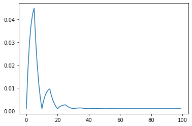
    


# 8.OneCycleLR - cos

Sets the learning rate of each parameter group according to the 1cycle learning rate policy. The 1cycle policy anneals the learning rate from an initial learning rate to some maximum learning rate and then from that maximum learning rate to some minimum learning rate much lower than the initial learning rate. This policy was initially described in the paper Super-Convergence: Very Fast Training of Neural Networks Using Large Learning Rates.

The 1cycle learning rate policy changes the learning rate after every batch. step should be called after a batch has been used for training.

This scheduler is not chainable.


```python

model = torch.nn.Linear(2, 1)
optimizer = torch.optim.SGD(model.parameters(), lr=0.1)
scheduler = torch.optim.lr_scheduler.OneCycleLR(optimizer, max_lr=0.1, steps_per_epoch=10, epochs=10)
lrs = []


for i in range(100):
    optimizer.step()
    lrs.append(optimizer.param_groups[0]["lr"])
    print("Factor = ",i," , Learning Rate = ",optimizer.param_groups[0]["lr"])
    scheduler.step()

plt.plot(lrs)

```

    Factor =  0  , Learning Rate =  0.0040000000000000036
    Factor =  1  , Learning Rate =  0.004281378056590748
    Factor =  2  , Learning Rate =  0.00512221332591585
    Factor =  3  , Learning Rate =  0.006512647783225481
    Factor =  4  , Learning Rate =  0.008436379855794068
    Factor =  5  , Learning Rate =  0.010870855543955726
    Factor =  6  , Learning Rate =  0.013787532846129102
    Factor =  7  , Learning Rate =  0.017152216387689725
    Factor =  8  , Learning Rate =  0.02092545833047227
    Factor =  9  , Learning Rate =  0.02506302086260566
    Factor =  10  , Learning Rate =  0.029516394846410082
    Factor =  11  , Learning Rate =  0.03423336854368411
    Factor =  12  , Learning Rate =  0.03915863975059739
    Factor =  13  , Learning Rate =  0.04423446416546729
    Factor =  14  , Learning Rate =  0.04940133238789996
    Factor =  15  , Learning Rate =  0.05459866761210004
    Factor =  16  , Learning Rate =  0.05976553583453271
    Factor =  17  , Learning Rate =  0.0648413602494026
    Factor =  18  , Learning Rate =  0.0697666314563159
    Factor =  19  , Learning Rate =  0.07448360515358993
    Factor =  20  , Learning Rate =  0.07893697913739435
    Factor =  21  , Learning Rate =  0.08307454166952773
    Factor =  22  , Learning Rate =  0.08684778361231027
    Factor =  23  , Learning Rate =  0.0902124671538709
    Factor =  24  , Learning Rate =  0.09312914445604428
    Factor =  25  , Learning Rate =  0.09556362014420594
    Factor =  26  , Learning Rate =  0.09748735221677451
    Factor =  27  , Learning Rate =  0.09887778667408416
    Factor =  28  , Learning Rate =  0.09971862194340926
    Factor =  29  , Learning Rate =  0.1
    Factor =  30  , Learning Rate =  0.09994965352845243
    Factor =  31  , Learning Rate =  0.09979871550490317
    Factor =  32  , Learning Rate =  0.09954748989844439
    Factor =  33  , Learning Rate =  0.09919648264401378
    Factor =  34  , Learning Rate =  0.09874640062350874
    Factor =  35  , Learning Rate =  0.09819815024222053
    Factor =  36  , Learning Rate =  0.09755283560345443
    Factor =  37  , Learning Rate =  0.09681175628501273
    Factor =  38  , Learning Rate =  0.09597640472201803
    Factor =  39  , Learning Rate =  0.09504846320134738
    Factor =  40  , Learning Rate =  0.09402980047373054
    Factor =  41  , Learning Rate =  0.09292246799033459
    Factor =  42  , Learning Rate =  0.09172869577141439
    Factor =  43  , Learning Rate =  0.0904508879153485
    Factor =  44  , Learning Rate =  0.089091617757105
    Factor =  45  , Learning Rate =  0.08765362268588736
    Factor =  46  , Learning Rate =  0.08613979863239682
    Factor =  47  , Learning Rate =  0.08455319423681344
    Factor =  48  , Learning Rate =  0.08289700470924045
    Factor =  49  , Learning Rate =  0.0811745653949763
    Factor =  50  , Learning Rate =  0.0793893450575732
    Factor =  51  , Learning Rate =  0.07754493889320883
    Factor =  52  , Learning Rate =  0.07564506129043984
    Factor =  53  , Learning Rate =  0.07369353834991745
    Factor =  54  , Learning Rate =  0.07169430017913009
    Factor =  55  , Learning Rate =  0.06965137297768985
    Factor =  56  , Learning Rate =  0.06756887092910233
    Factor =  57  , Learning Rate =  0.0654509879153485
    Factor =  58  , Learning Rate =  0.06330198907096464
    Factor =  59  , Learning Rate =  0.06112620219362893
    Factor =  60  , Learning Rate =  0.05892800902855288
    Factor =  61  , Learning Rate =  0.05671183644422961
    Factor =  62  , Learning Rate =  0.0544821475173099
    Factor =  63  , Learning Rate =  0.05224343254455968
    Factor =  64  , Learning Rate =  0.0500002
    Factor =  65  , Learning Rate =  0.04775696745544034
    Factor =  66  , Learning Rate =  0.04551825248269011
    Factor =  67  , Learning Rate =  0.043288563555770404
    Factor =  68  , Learning Rate =  0.04107239097144713
    Factor =  69  , Learning Rate =  0.03887419780637107
    Factor =  70  , Learning Rate =  0.03669841092903536
    Factor =  71  , Learning Rate =  0.03454941208465151
    Factor =  72  , Learning Rate =  0.03243152907089768
    Factor =  73  , Learning Rate =  0.030349027022310158
    Factor =  74  , Learning Rate =  0.028306099820869922
    Factor =  75  , Learning Rate =  0.026306861650082565
    Factor =  76  , Learning Rate =  0.024355338709560182
    Factor =  77  , Learning Rate =  0.022455461106791173
    Factor =  78  , Learning Rate =  0.02061105494242681
    Factor =  79  , Learning Rate =  0.0188258346050237
    Factor =  80  , Learning Rate =  0.017103395290759566
    Factor =  81  , Learning Rate =  0.015447205763186572
    Factor =  82  , Learning Rate =  0.013860601367603195
    Factor =  83  , Learning Rate =  0.012346777314112658
    Factor =  84  , Learning Rate =  0.010908782242895008
    Factor =  85  , Learning Rate =  0.009549512084651508
    Factor =  86  , Learning Rate =  0.008271704228585617
    Factor =  87  , Learning Rate =  0.007077932009665416
    Factor =  88  , Learning Rate =  0.005970599526269472
    Factor =  89  , Learning Rate =  0.004951936798652629
    Factor =  90  , Learning Rate =  0.004023995277981982
    Factor =  91  , Learning Rate =  0.003188643714987268
    Factor =  92  , Learning Rate =  0.0024475643965455826
    Factor =  93  , Learning Rate =  0.0018022497577794773
    Factor =  94  , Learning Rate =  0.0012539993764912555
    Factor =  95  , Learning Rate =  0.0008039173559862364
    Factor =  96  , Learning Rate =  0.0004529101015556186
    Factor =  97  , Learning Rate =  0.00020168449509684564
    Factor =  98  , Learning Rate =  5.07464715475788e-05
    Factor =  99  , Learning Rate =  4e-07
    


    [<matplotlib.lines.Line2D at 0x29bd185a730>]


    
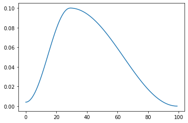
    


# 8.OneCycleLR - linear


```python

model = torch.nn.Linear(2, 1)
optimizer = torch.optim.SGD(model.parameters(), lr=0.1)
scheduler = torch.optim.lr_scheduler.OneCycleLR(optimizer, max_lr=0.1, steps_per_epoch=10, epochs=10,anneal_strategy='linear')
lrs = []


for i in range(100):
    optimizer.step()
    lrs.append(optimizer.param_groups[0]["lr"])
    print("Factor = ",i," , Learning Rate = ",optimizer.param_groups[0]["lr"])
    scheduler.step()

plt.plot(lrs)

```

    Factor =  0  , Learning Rate =  0.004
    Factor =  1  , Learning Rate =  0.007310344827586207
    Factor =  2  , Learning Rate =  0.010620689655172414
    Factor =  3  , Learning Rate =  0.013931034482758621
    Factor =  4  , Learning Rate =  0.017241379310344827
    Factor =  5  , Learning Rate =  0.020551724137931035
    Factor =  6  , Learning Rate =  0.023862068965517243
    Factor =  7  , Learning Rate =  0.02717241379310345
    Factor =  8  , Learning Rate =  0.030482758620689655
    Factor =  9  , Learning Rate =  0.033793103448275866
    Factor =  10  , Learning Rate =  0.037103448275862067
    Factor =  11  , Learning Rate =  0.04041379310344828
    Factor =  12  , Learning Rate =  0.04372413793103448
    Factor =  13  , Learning Rate =  0.047034482758620696
    Factor =  14  , Learning Rate =  0.0503448275862069
    Factor =  15  , Learning Rate =  0.05365517241379311
    Factor =  16  , Learning Rate =  0.05696551724137931
    Factor =  17  , Learning Rate =  0.06027586206896551
    Factor =  18  , Learning Rate =  0.06358620689655173
    Factor =  19  , Learning Rate =  0.06689655172413793
    Factor =  20  , Learning Rate =  0.07020689655172414
    Factor =  21  , Learning Rate =  0.07351724137931034
    Factor =  22  , Learning Rate =  0.07682758620689656
    Factor =  23  , Learning Rate =  0.08013793103448277
    Factor =  24  , Learning Rate =  0.08344827586206897
    Factor =  25  , Learning Rate =  0.08675862068965517
    Factor =  26  , Learning Rate =  0.09006896551724139
    Factor =  27  , Learning Rate =  0.09337931034482759
    Factor =  28  , Learning Rate =  0.0966896551724138
    Factor =  29  , Learning Rate =  0.1
    Factor =  30  , Learning Rate =  0.09857143428571429
    Factor =  31  , Learning Rate =  0.09714286857142858
    Factor =  32  , Learning Rate =  0.09571430285714286
    Factor =  33  , Learning Rate =  0.09428573714285715
    Factor =  34  , Learning Rate =  0.09285717142857143
    Factor =  35  , Learning Rate =  0.09142860571428572
    Factor =  36  , Learning Rate =  0.09000004
    Factor =  37  , Learning Rate =  0.0885714742857143
    Factor =  38  , Learning Rate =  0.08714290857142858
    Factor =  39  , Learning Rate =  0.08571434285714286
    Factor =  40  , Learning Rate =  0.08428577714285715
    Factor =  41  , Learning Rate =  0.08285721142857143
    Factor =  42  , Learning Rate =  0.08142864571428572
    Factor =  43  , Learning Rate =  0.08000008
    Factor =  44  , Learning Rate =  0.0785715142857143
    Factor =  45  , Learning Rate =  0.07714294857142857
    Factor =  46  , Learning Rate =  0.07571438285714285
    Factor =  47  , Learning Rate =  0.07428581714285715
    Factor =  48  , Learning Rate =  0.07285725142857144
    Factor =  49  , Learning Rate =  0.07142868571428572
    Factor =  50  , Learning Rate =  0.07000012
    Factor =  51  , Learning Rate =  0.06857155428571429
    Factor =  52  , Learning Rate =  0.06714298857142857
    Factor =  53  , Learning Rate =  0.06571442285714285
    Factor =  54  , Learning Rate =  0.06428585714285714
    Factor =  55  , Learning Rate =  0.06285729142857144
    Factor =  56  , Learning Rate =  0.06142872571428572
    Factor =  57  , Learning Rate =  0.06000016
    Factor =  58  , Learning Rate =  0.05857159428571428
    Factor =  59  , Learning Rate =  0.05714302857142858
    Factor =  60  , Learning Rate =  0.05571446285714286
    Factor =  61  , Learning Rate =  0.05428589714285715
    Factor =  62  , Learning Rate =  0.05285733142857143
    Factor =  63  , Learning Rate =  0.051428765714285715
    Factor =  64  , Learning Rate =  0.0500002
    Factor =  65  , Learning Rate =  0.048571634285714295
    Factor =  66  , Learning Rate =  0.047143068571428574
    Factor =  67  , Learning Rate =  0.04571450285714286
    Factor =  68  , Learning Rate =  0.04428593714285714
    Factor =  69  , Learning Rate =  0.042857371428571434
    Factor =  70  , Learning Rate =  0.04142880571428571
    Factor =  71  , Learning Rate =  0.040000240000000006
    Factor =  72  , Learning Rate =  0.038571674285714286
    Factor =  73  , Learning Rate =  0.03714310857142858
    Factor =  74  , Learning Rate =  0.03571454285714286
    Factor =  75  , Learning Rate =  0.03428597714285714
    Factor =  76  , Learning Rate =  0.03285741142857143
    Factor =  77  , Learning Rate =  0.03142884571428571
    Factor =  78  , Learning Rate =  0.030000280000000004
    Factor =  79  , Learning Rate =  0.028571714285714284
    Factor =  80  , Learning Rate =  0.027143148571428577
    Factor =  81  , Learning Rate =  0.025714582857142856
    Factor =  82  , Learning Rate =  0.02428601714285715
    Factor =  83  , Learning Rate =  0.02285745142857143
    Factor =  84  , Learning Rate =  0.02142888571428571
    Factor =  85  , Learning Rate =  0.020000319999999988
    Factor =  86  , Learning Rate =  0.01857175428571428
    Factor =  87  , Learning Rate =  0.01714318857142856
    Factor =  88  , Learning Rate =  0.015714622857142854
    Factor =  89  , Learning Rate =  0.014286057142857148
    Factor =  90  , Learning Rate =  0.012857491428571427
    Factor =  91  , Learning Rate =  0.01142892571428572
    Factor =  92  , Learning Rate =  0.01000036
    Factor =  93  , Learning Rate =  0.008571794285714293
    Factor =  94  , Learning Rate =  0.007143228571428573
    Factor =  95  , Learning Rate =  0.005714662857142852
    Factor =  96  , Learning Rate =  0.0042860971428571315
    Factor =  97  , Learning Rate =  0.002857531428571425
    Factor =  98  , Learning Rate =  0.0014289657142857043
    Factor =  99  , Learning Rate =  3.999999999976245e-07
    


    [<matplotlib.lines.Line2D at 0x29bd1884fd0>]


    
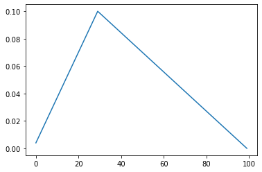
    


# 9.CosineAnnealingWarmRestarts
Set the learning rate of each parameter group using a cosine annealing schedule, and restarts after Ti epochs.


$$
\eta_{t}=\eta_{\min }+\frac{1}{2}\left(\eta_{\max }-\eta_{\min }\right)\left(1+\cos \left(\frac{T_{\operatorname{cur}}}{T_{i}} \pi\right)\right)
$$


```python
import torch
import matplotlib.pyplot as plt

model = torch.nn.Linear(2, 1)
optimizer = torch.optim.SGD(model.parameters(), lr=0.1)
lr_sched = torch.optim.lr_scheduler.CosineAnnealingWarmRestarts(optimizer, T_0=10, T_mult=1, eta_min=0.001, last_epoch=-1)


lrs = []

for i in range(100):
    lr_sched.step()
    lrs.append(
        optimizer.param_groups[0]["lr"]
    )

plt.plot(lrs)
```


    [<matplotlib.lines.Line2D at 0x7f5344c93ad0>]


    
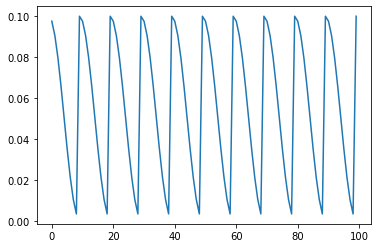
    


```python
import torch
import matplotlib.pyplot as plt

model = torch.nn.Linear(2, 1)
optimizer = torch.optim.SGD(model.parameters(), lr=0.1)
lr_sched = torch.optim.lr_scheduler.CosineAnnealingWarmRestarts(optimizer, T_0=10, T_mult=2, eta_min=0.01, last_epoch=-1)


lrs = []

for i in range(300):
    lr_sched.step()
    lrs.append(
        optimizer.param_groups[0]["lr"]
    )

plt.plot(lrs)
```


    [<matplotlib.lines.Line2D at 0x7f5344bffa10>]


    
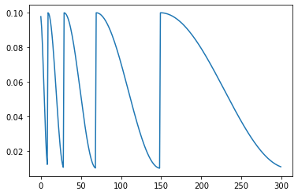
    


```python

```
